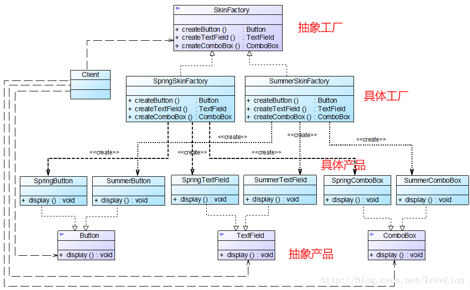

# 设计模式

总体来说设计模式分为三大类：

创建型模式，共五种：工厂方法模式、抽象工厂模式、单例模式、建造者模式、原型模式。

结构型模式，共七种：适配器模式、装饰器模式、代理模式、外观模式、桥接模式、组合模式、享元模式。

行为型模式，共十一种：策略模式、模板方法模式、观察者模式、迭代子模式、责任链模式、命令模式、备忘录模式、状态模式、访问者模式、中介者模式、解释器模式。

==**其中创建型模式主要用于描述如何创建对象，结构型模式主要用于描述如何实现类或对象的组合，行为型模式主要用于描述类或对象怎样交互以及怎样分配职责**==

<br/>

## 七个面向对象设计原则

1. 开闭原则：
一个软件实体应当对扩展开放，对修改关闭。即软件实体应尽量在不修改原有代码的情况下进行扩展。
2. 单一职责原则：
一个类只负责一个功能领域中的相应职责，或者可以定义为：就一个类而言，应该只有一个引起它变化的原因。
如：DBUtil做连接数据库，CustomerDao做操作数据库中customer表，CustomerDataChart负责图表的生成和显示
3. 里氏代换原则：
所有引用基类（父类）的地方必须能透明地使用其子类的对象。
==**在软件中将一个基类对象替换成它的子类对象，程序将不会产生任何错误和异常。尽量使用基类类型来对对象进行定义，而在运行时再确定其子类类型，用子类对象来替换父类对象**==。
4. 依赖倒转原则：
抽象不应该依赖于细节，细节应当依赖于抽象。换言之，要针对接口编程，而不是针对实现编程。
==将参数的改变放到配置文件中，就不会改变源代码，符合开闭原则。面向接口的编程==
   
   
   > 依赖倒转原则要求我们在程序代码中**传递参数时或在关联关系中，尽量引用层次高的抽象层类**，即使用接口和抽象类进行变量类型声明、参数类型声明、方法返回类型声明，以及数据类型的转换等，而不要用具体类来做这些事情。为了确保该原则的应用，**一个具体类应当只实现接口或抽象类中声明过的方法，而不要给出多余的方法，否则将无法调用到在子类中增加的新方法。**

   > 
   > 在实现依赖倒转原则时，我们需要针对抽象层编程，而**将具体类的对象通过依赖注入(DependencyInjection, DI)的方式注入到其他对象中，依赖注入是指当一个对象要与其他对象发生依赖关系时，通过抽象来注入所依赖的对象。常用的注入方式有三种，分别是：构造注入，设值注入（Setter注入）和接口注入。**构造注入是指通过构造函数来传入具体类的对象，设值注入是指通过Setter方法来传入具体类的对象，而接口注入是指通过在接口中声明的业务方法来传入具体类的对象。这些方法在定义时使用的是抽象类型，在运行时再传入具体类型的对象，由子类对象来覆盖父类对象。
   
   在大多数情况下，这三个设计原则会同时出现，开闭原则是目标，里氏代换原则是基础，依赖倒转原则是手段
5. 接口隔离原则：
使用多个专门的接口，而不使用单一的总接口，即客户端不应该依赖那些它不需要的接口。
   > 每一个接口应该承担一种相对独立的角色，不干不该干的事，该干的事都要干
6. 合成复用原则：
尽量使用对象组合，而不是继承来达到复用的目的。
   > 复用时要尽量使用组合/聚合关系（关联关系），少用继承，降低类与类之间的耦合度。比如连接数据库的方法getConnection()封装在DBUtil类，mysql调用连接方法不是继承DBUtil类，而是调用DBUtil类的连接方法。
7. 迪米特原则：
一个软件实体应当尽可能少地与其他实体发生相互作用。
   > 如果一个系统符合迪米特法则，那么当其中某一个模块发生修改时，就会尽量少地影响其他模块，扩展会相对容易，这是对软件实体之间通信的限制，**迪米特法则要求限制软件实体之间通信的宽度和深度。迪米特法则可降低系统的耦合度，使类与类之间保持松散的耦合关系。**
   > 
   > <br/>
   > 
   >   迪米特法则还有几种定义形式，包括：不要和“陌生人”说话、只与你的直接朋友通信等，在迪米特法则中，对于一个对象，其朋友包括以下几类：
   > 
   > ```
   >   (1) 当前对象本身(this)；
   > 
   >   (2) 以参数形式传入到当前对象方法中的对象；
   > 
   >   (3) 当前对象的成员对象；
   > 
   >   (4) 如果当前对象的成员对象是一个集合，那么集合中的元素也都是朋友；
   > 
   >   (5) 当前对象所创建的对象。
   > ```

<br/>

## 0.简单工厂模式

简单工厂模式(Simple Factory Pattern)：定义一个工厂类，它可以根据参数的不同返回不同类的实例，被创建的实例通常都具有共同的父类。因为在简单工厂模式中用于创建实例的方法是静态(static)方法，因此简单工厂模式又被称为静态工厂方法(Static Factory Method)模式，它属于类创建型模式。

> 简单工厂模式的要点在于：当你需要什么，只需要传入一个正确的参数，就可以获取你所需要的对象，而无须知道其创建细节。简单工厂模式结构比较简单，其核心是工厂类的设计.


**总结：**

```
     1. 主要优点
     
   简单工厂模式的主要优点如下：

   (1) 工厂类包含必要的判断逻辑，可以决定在什么时候创建哪一个产品类的实例，客户端可以免除直接创建产品对象的职责，而仅仅“消费”产品，简单工厂模式实现了对象创建和使用的分离。

   (2) 客户端无须知道所创建的具体产品类的类名，只需要知道具体产品类所对应的参数即可，对于一些复杂的类名，通过简单工厂模式可以在一定程度减少使用者的记忆量。

   (3) 通过引入配置文件，可以在不修改任何客户端代码的情况下更换和增加新的具体产品类，在一定程度上提高了系统的灵活性。

     2. 主要缺点

   简单工厂模式的主要缺点如下：

   (1) 由于工厂类集中了所有产品的创建逻辑，职责过重，一旦不能正常工作，整个系统都要受到影响。

   (2) 使用简单工厂模式势必会增加系统中类的个数（引入了新的工厂类），增加了系统的复杂度和理解难度。

   (3) 系统扩展困难，一旦添加新产品就不得不修改工厂逻辑，在产品类型较多时，有可能造成工厂逻辑过于复杂，不利于系统的扩展和维护。

   (4) 简单工厂模式由于使用了静态工厂方法，造成工厂角色无法形成基于继承的等级结构。

    3. 适用场景

   在以下情况下可以考虑使用简单工厂模式：

   (1) 工厂类负责创建的对象比较少，由于创建的对象较少，不会造成工厂方法中的业务逻辑太过复杂。

   (2) 客户端只知道传入工厂类的参数，对于如何创建对象并不关心。
```

<br/>

## 1.工厂方法模式

工厂方法模式(Factory Method Pattern)：定义一个用于创建对象的接口，让子类决定将哪一个类实例化。工厂方法模式让一个类的实例化延迟到其子类。工厂方法模式又简称为工厂模式(Factory Pattern)，又可称作虚拟构造器模式(Virtual Constructor Pattern)或多态工厂模式(Polymorphic Factory Pattern)。工厂方法模式是一种类创建型模式。


<br/>

> Logger接口充当抽象产品，其子类FileLogger和DatabaseLogger充当具体产品，LoggerFactory接口充当抽象工厂，其子类FileLoggerFactory和DatabaseLoggerFactory充当具体工厂。完整代码如下所示：
> 
> ```java
> //日志记录器接口：抽象产品
> interface Logger {
> 	public void writeLog();
> }
>  
> //数据库日志记录器：具体产品
> class DatabaseLogger implements Logger {
> 	public void writeLog() {
> 		System.out.println("数据库日志记录。");
> 	}
> }
>  
> //文件日志记录器：具体产品
> class FileLogger implements Logger {
> 	public void writeLog() {
> 		System.out.println("文件日志记录。");
> 	}
> }
>  
> //日志记录器工厂接口：抽象工厂
> interface LoggerFactory {
> 	public Logger createLogger();
> }
> ```

> XML格式的配置文件config.xml用于存储具体日志记录器工厂类类名：
> 
> ```xml
> <!— config.xml -->
> <?xml version="1.0"?>
> <config>
> 	<className>FileLoggerFactory</className>
> </config>
> ```
> 
>   为了读取该配置文件并通过存储在其中的类名字符串反射生成对象，Sunny公司开发人员开发了一个名为XMLUtil的工具类，其详细代码如下所示：
> 
> ```java
> //工具类XMLUtil.java
> import javax.xml.parsers.*;
> import org.w3c.dom.*;
> import org.xml.sax.SAXException;
> import java.io.*;
>  
> public class XMLUtil {
> //该方法用于从XML配置文件中提取具体类类名，并返回一个实例对象
> 	public static Object getBean() {
> 		try {
> 			//创建DOM文档对象
> 			DocumentBuilderFactory dFactory = DocumentBuilderFactory.newInstance();
> 			DocumentBuilder builder = dFactory.newDocumentBuilder();
> 			Document doc;							
> 			doc = builder.parse(new File("config.xml")); 
> 		
> 			//获取包含类名的文本节点
> 			NodeList nl = doc.getElementsByTagName("className");
>             Node classNode=nl.item(0).getFirstChild();
>             String cName=classNode.getNodeValue();
>             
>             //通过类名生成实例对象并将其返回
>             Class c=Class.forName(cName);
> 	  	    Object obj=c.newInstance();
>             return obj;
>         }   
>         catch(Exception e) {
>            	e.printStackTrace();
>            	return null;
>          }
>     }
> }
> ```
> 
> 有了XMLUtil类后，可以对日志记录器的客户端代码进行修改，不再直接使用new关键字来创建具体的工厂类，而是将具体工厂类的类名存储在XML文件中，再通过XMLUtil类的静态工厂方法getBean()方法进行对象的实例化，代码修改如下：
> 
> ```java
> class Client {
> 	public static void main(String args[]) {
> 		LoggerFactory factory;
> 		Logger logger;
> 		factory = (LoggerFactory)XMLUtil.getBean(); //getBean()的返回类型为Object，需要进行强制类型转换
> 		logger = factory.createLogger();
> 		logger.writeLog();
> 	}
> }
> ```

<br/>

**工厂方法模式总结**
      工厂方法模式是简单工厂模式的延伸，它继承了简单工厂模式的优点，同时还弥补了简单工厂模式的不足。工厂方法模式是使用频率最高的设计模式之一，是很多开源框架和API类库的核心模式。

```
  1. 主要优点

       工厂方法模式的主要优点如下：

       (1) 在工厂方法模式中，工厂方法用来创建客户所需要的产品，同时还向客户隐藏了哪种具体产品类将被实例化这一细节，用户只需要关心所需产品对应的工厂，无须关心创建细节，甚至无须知道具体产品类的类名。

       (2) 基于工厂角色和产品角色的多态性设计是工厂方法模式的关键。它能够让工厂可以自主确定创建何种产品对象，而如何创建这个对象的细节则完全封装在具体工厂内部。工厂方法模式之所以又被称为多态工厂模式，就正是因为所有的具体工厂类都具有同一抽象父类。

       (3) 使用工厂方法模式的另一个优点是在系统中加入新产品时，无须修改抽象工厂和抽象产品提供的接口，无须修改客户端，也无须修改其他的具体工厂和具体产品，而只要添加一个具体工厂和具体产品就可以了，这样，系统的可扩展性也就变得非常好，完全符合“开闭原则”。


      2. 主要缺点

     工厂方法模式的主要缺点如下：

      (1) 在添加新产品时，需要编写新的具体产品类，而且还要提供与之对应的具体工厂类，系统中类的个数将成对增加，在一定程度上增加了系统的复杂度，有更多的类需要编译和运行，会给系统带来一些额外的开销。

      (2) 由于考虑到系统的可扩展性，需要引入抽象层，在客户端代码中均使用抽象层进行定义，增加了系统的抽象性和理解难度，且在实现时可能需要用到DOM、反射等技术，增加了系统的实现难度。
 

       3. 适用场景

       在以下情况下可以考虑使用工厂方法模式：

       (1) 客户端不知道它所需要的对象的类。在工厂方法模式中，客户端不需要知道具体产品类的类名，只需要知道所对应的工厂即可，具体的产品对象由具体工厂类创建，可将具体工厂类的类名存储在配置文件或数据库中。

       (2) 抽象工厂类通过其子类来指定创建哪个对象。在工厂方法模式中，对于抽象工厂类只需要提供一个创建产品的接口，而由其子类来确定具体要创建的对象，利用面向对象的多态性和里氏代换原则，在程序运行时，子类对象将覆盖父类对象，从而使得系统更容易扩展。
```

<br/>

## 2.抽象工厂模式

  抽象工厂模式(Abstract Factory Pattern)：提供一个创建一系列相关或相互依赖对象的接口，而无须指定它们具体的类。抽象工厂模式又称为Kit模式，它是一种对象创建型模式。

>    在抽象工厂模式结构图中包含如下几个角色：
> 
> ```
>    ● AbstractFactory（抽象工厂）：它声明了一组用于创建一族产品的方法，每一个方法对应一种产品。
> 
>    ● ConcreteFactory（具体工厂）：它实现了在抽象工厂中声明的创建产品的方法，生成一组具体产品，这些产品构成了一个产品族，每一个产品都位于某个产品等级结构中。
> 
>    ● AbstractProduct（抽象产品）：它为每种产品声明接口，在抽象产品中声明了产品所具有的业务方法。
> 
>    ● ConcreteProduct（具体产品）：它定义具体工厂生产的具体产品对象，实现抽象产品接口中声明的业务方法。
> ```



<br/>

SkinFactory接口充当抽象工厂，其子类SpringSkinFactory和SummerSkinFactory充当具体工厂，接口Button、TextField和ComboBox充当抽象产品，其子类SpringButton、SpringTextField、SpringComboBox和SummerButton、SummerTextField、SummerComboBox充当具体产品。完整代码如下所示：

```java
//在本实例中我们对代码进行了大量简化，实际使用时，界面组件的初始化代码较为复杂，还需要使用JDK中一些已有类，为了突出核心代码，在此只提供框架代码和演示输出。
//按钮接口：抽象产品
interface Button {
	public void display();
}
 
//Spring按钮类：具体产品
class SpringButton implements Button {
	public void display() {
		System.out.println("显示浅绿色按钮。");
	}
}
 
//Summer按钮类：具体产品
class SummerButton implements Button {
	public void display() {
		System.out.println("显示浅蓝色按钮。");
	}	
}
 
//文本框接口：抽象产品
interface TextField {
	public void display();
}
 
//Spring文本框类：具体产品
class SpringTextField implements TextField {
	public void display() {
		System.out.println("显示绿色边框文本框。");
	}
}
 
//Summer文本框类：具体产品
class SummerTextField implements TextField {
	public void display() {
		System.out.println("显示蓝色边框文本框。");
	}	
}
 
//组合框接口：抽象产品
interface ComboBox {
	public void display();
}
 
//Spring组合框类：具体产品
class SpringComboBox implements ComboBox {
	public void display() {
		System.out.println("显示绿色边框组合框。");
	}
}
 
//Summer组合框类：具体产品
class SummerComboBox implements ComboBox {
	public void display() {
		System.out.println("显示蓝色边框组合框。");
	}	
}
 
//界面皮肤工厂接口：抽象工厂
interface SkinFactory {
	public Button createButton();
	public TextField createTextField();
	public ComboBox createComboBox();
}
 
//Spring皮肤工厂：具体工厂
class SpringSkinFactory implements SkinFactory {
	public Button createButton() {
		return new SpringButton();
	}
 
	public TextField createTextField() {
		return new SpringTextField();
	}
 
	public ComboBox createComboBox() {
		return new SpringComboBox();
	}
}
 
//Summer皮肤工厂：具体工厂
class SummerSkinFactory implements SkinFactory {
	public Button createButton() {
		return new SummerButton();
	}
 
	public TextField createTextField() {
		return new SummerTextField();
	}
 
	public ComboBox createComboBox() {
		return new SummerComboBox();
	}
}
```

为了让系统具备良好的灵活性和可扩展性，我们引入了工具类XMLUtil和配置文件，其中，XMLUtil类的代码如下所示：

```java
import javax.xml.parsers.*;
import org.w3c.dom.*;
import org.xml.sax.SAXException;
import java.io.*;
 
public class XMLUtil {
//该方法用于从XML配置文件中提取具体类类名，并返回一个实例对象
	public static Object getBean() {
		try {
			//创建文档对象
			DocumentBuilderFactory dFactory = DocumentBuilderFactory.newInstance();
			DocumentBuilder builder = dFactory.newDocumentBuilder();
			Document doc;							
			doc = builder.parse(new File("config.xml")); 
		
			//获取包含类名的文本节点
			NodeList nl = doc.getElementsByTagName("className");
            Node classNode=nl.item(0).getFirstChild();
            String cName=classNode.getNodeValue();
            
            //通过类名生成实例对象并将其返回
            Class c=Class.forName(cName);
	  	    Object obj=c.newInstance();
            return obj;
        }   
        catch(Exception e) {
           	e.printStackTrace();
           	return null;
       	}
	}
}
```

配置文件config.xml中存储了具体工厂类的类名，代码如下所示：

```xml
<?xml version="1.0"?>
<config>
	<className>SpringSkinFactory</className>
</config>
```

  编写如下客户端测试代码：

```java
class Client {
	public static void main(String args[]) {
        //使用抽象层定义
		SkinFactory factory;
		Button bt;
		TextField tf;
		ComboBox cb;
		factory = (SkinFactory)XMLUtil.getBean();
		bt = factory.createButton();
		tf = factory.createTextField();
		cb = factory.createComboBox();
		bt.display();
		tf.display();
		cb.display();
	}
}
```

<br/>

> **抽象工厂模式总结**
       抽象工厂模式是工厂方法模式的进一步延伸，由于它提供了功能更为强大的工厂类并且具备较好的可扩展性，在软件开发中得以广泛应用，尤其是在一些框架和API类库的设计中，例如在Java语言的AWT（抽象窗口工具包）中就使用了抽象工厂模式，它使用抽象工厂模式来实现在不同的操作系统中应用程序呈现与所在操作系统一致的外观界面。抽象工厂模式也是在软件开发中最常用的设计模式之一。
> 
> ```
>    1. 主要优点
> 
>    抽象工厂模式的主要优点如下：
> 
>    (1) 抽象工厂模式隔离了具体类的生成，使得客户并不需要知道什么被创建。由于这种隔离，更换一个具体工厂就变得相对容易，所有的具体工厂都实现了抽象工厂中定义的那些公共接口，因此只需改变具体工厂的实例，就可以在某种程度上改变整个软件系统的行为。
> 
>    (2) 当一个产品族中的多个对象被设计成一起工作时，它能够保证客户端始终只使用同一个产品族中的对象。
> 
>    (3) 增加新的产品族很方便，无须修改已有系统，符合“开闭原则”。
> 
> 
>    2. 主要缺点
> 
>    抽象工厂模式的主要缺点如下：
> 
>    增加新的产品等级结构麻烦，需要对原有系统进行较大的修改，甚至需要修改抽象层代码，这显然会带来较大的不便，违背了“开闭原则”。
> 
> 
>    3. 适用场景
> 
>    在以下情况下可以考虑使用抽象工厂模式：
> 
>    (1) 一个系统不应当依赖于产品类实例如何被创建、组合和表达的细节，这对于所有类型的工厂模式都是很重要的，用户无须关心对象的创建过程，将对象的创建和使用解耦。
> 
>    (2) 系统中有多于一个的产品族，而每次只使用其中某一产品族。可以通过配置文件等方式来使得用户可以动态改变产品族，也可以很方便地增加新的产品族。
> 
>    (3) 属于同一个产品族的产品将在一起使用，这一约束必须在系统的设计中体现出来。同一个产品族中的产品可以是没有任何关系的对象，但是它们都具有一些共同的约束，如同一操作系统下的按钮和文本框，按钮与文本框之间没有直接关系，但它们都是属于某一操作系统的，此时具有一个共同的约束条件：操作系统的类型。
> 
>    (4) 产品等级结构稳定，设计完成之后，不会向系统中增加新的产品等级结构或者删除已有的产品等级结构。
> ```

<br/>

## 3.单例模式

**三种单例类的实现方式一共有三种，分别是：饿汉式单例、懒汉式单例以及IoDH**

单例模式(Singleton Pattern)：确保某一个类只有一个实例，而且自行实例化并向整个系统提供这个实例，这个类称为单例类，它提供全局访问的方法。单例模式是一种对象创建型模式。

>  单例模式有三个要点：一是某个类只能有一个实例；二是它必须自行创建这个实例；三是它必须自行向整个系统提供这个实例。


>  单例模式结构图中只包含一个单例角色：
> 
>   ● Singleton（单例）：在单例类的内部实现只生成一个实例，同时它提供一个静态的getInstance()工厂方法，让客户可以访问它的唯一实例；为了防止在外部对其实例化，将其构造函数设计为私有；在单例类内部定义了一个Singleton类型的静态对象，作为外部共享的唯一实例。

<br/>

### 1.饿汉式单例类

  饿汉式单例类是实现起来最简单的单例类，由于在定义静态变量的时候实例化单例类，因此在类加载的时候就已经创建了单例对象

```java
class EagerSingleton { 
    private static final EagerSingleton instance = new EagerSingleton(); 
    private EagerSingleton() { } 
 
    public static EagerSingleton getInstance() {
        return instance; 
    }   
}
```

>   当类被加载时，静态变量instance会被初始化，此时类的私有构造函数会被调用，单例类的唯一实例将被创建。如果使用饿汉式单例来实现负载均衡器LoadBalancer类的设计，则不会出现创建多个单例对象的情况，可确保单例对象的唯一性。

<br/>

### 2.懒汉式单例类与线程锁定

懒汉式单例在第一次调用getInstance()方法时实例化，在类加载时并不自行实例化，这种技术又称为延迟加载(Lazy Load)技术，即需要的时候再加载实例，为了避免多个线程同时调用getInstance()方法，我们可以使用关键字synchronized

```java
class LazySingleton { 
    private static LazySingleton instance = null; 
 
    private LazySingleton() { } 
 
    synchronized public static LazySingleton getInstance() { 
        if (instance == null) {
            instance = new LazySingleton(); 
        }
        return instance; 
    }
}
```

该懒汉式单例类在getInstance()方法前面增加了关键字synchronized进行线程锁，以处理多个线程同时访问的问题。但是，上述代码虽然解决了线程安全问题，但是**每次调用getInstance()时都需要进行线程锁定判断，在多线程高并发访问环境中，将会导致系统性能大大降低。**==因此需要进行进一步改进，在synchronized中再进行一次(instance  null)判断，这种方式称为**双重检查锁**定(Double-Check Locking)。==

```java
class LazySingleton { 
    private volatile static LazySingleton instance = null; 
 
    private LazySingleton() { } 
 
    public static LazySingleton getInstance() { 
        //第一重判断
        if (instance == null) {
            //锁定代码块
            synchronized (LazySingleton.class) {
                //第二重判断
                if (instance == null) {
                    instance = new LazySingleton(); //创建单例实例
                }
            }
        }
        return instance; 
    }
}
```

>  需要注意的是，如果使用双重检查锁定来实现懒汉式单例类，需要在静态成员变量instance之前增加修饰符volatile，被volatile修饰的成员变量可以确保多个线程都能够正确处理，且该代码只能在JDK 1.5及以上版本中才能正确执行。由于volatile关键字会屏蔽Java虚拟机所做的一些代码优化，可能会导致系统运行效率降低，因此即使使用双重检查锁定来实现单例模式也不是一种完美的实现方式。 

<br/>

### 3.一种更好的单例实现方法（IoDH）

		饿汉式单例类不能实现延迟加载，不管将来用不用始终占据内存；懒汉式单例类线程安全控制烦琐，而且性能受影响。可见，无论是饿汉式单例还是懒汉式单例都存在这样那样的问题，有没有一种方法，能够将两种单例的缺点都克服，而将两者的优点合二为一呢？答案是：Yes！下面我们来学习这种更好的被称之为Initialization Demand Holder (IoDH)的技术。

- **在IoDH中，我们在单例类中增加一个静态(static)内部类，在该内部类中创建单例对象，再将该单例对象通过getInstance()方法返回给外部使用，实现代码如下所示：**

```java
//Initialization on Demand Holder
class Singleton {
	private Singleton() {
	}
	
	private static class HolderClass {
            private final static Singleton instance = new Singleton();
	}
	
	public static Singleton getInstance() {
	    return HolderClass.instance;
	}
	
	public static void main(String args[]) {
	    Singleton s1, s2; 
            s1 = Singleton.getInstance();
	    s2 = Singleton.getInstance();
	    System.out.println(s1==s2);
	}
}
```

>  编译并运行上述代码，运行结果为：true，即创建的单例对象s1和s2为同一对象。由于静态单例对象没有作为Singleton的成员变量直接实例化，因此类加载时不会实例化Singleton(**静态内部类和非静态内部类一样，都是在被调用时才会被加载**)，第一次调用getInstance()时将加载内部类HolderClass，在该内部类中定义了一个static类型的变量instance，此时会首先初始化这个成员变量，由Java虚拟机来保证其线程安全性，确保该成员变量只能初始化一次。由于getInstance()方法没有任何线程锁定，因此其性能不会造成任何影响。

<br/>

** 通过使用IoDH，我们既可以实现延迟加载，又可以保证线程安全，不影响系统性能，不失为一种最好的Java语言单例模式实现方式**（其缺点是与编程语言本身的特性相关，很多面向对象语言不支持IoDH）。

<br/>

**单例模式总结:**

> 1.主要优点
> 
> ```
>    单例模式的主要优点如下：
> 
>    (1) 单例模式提供了对唯一实例的受控访问。因为单例类封装了它的唯一实例，所以它可以严格控制客户怎样以及何时访问它。
> 
>    (2) 由于在系统内存中只存在一个对象，因此可以节约系统资源，对于一些需要频繁创建和销毁的对象单例模式无疑可以提高系统的性能。
> 
>    (3) 允许可变数目的实例。基于单例模式我们可以进行扩展，使用与单例控制相似的方法来获得指定个数的对象实例，既节省系统资源，又解决了单例单例对象共享过多有损性能的问题。
> ```
> 
> 2.主要缺点
> 
> ```
>    单例模式的主要缺点如下：
> 
>    (1) 由于单例模式中没有抽象层，因此单例类的扩展有很大的困难。
> 
>    (2) 单例类的职责过重，在一定程度上违背了“单一职责原则”。因为单例类既充当了工厂角色，提供了工厂方法，同时又充当了产品角色，包含一些业务方法，将产品的创建和产品的本身的功能融合到一起。
> 
>    (3) 现在很多面向对象语言(如Java、C#)的运行环境都提供了自动垃圾回收的技术，因此，如果实例化的共享对象长时间不被利用，系统会认为它是垃圾，会自动销毁并回收资源，下次利用时又将重新实例化，这将导致共享的单例对象状态的丢失。
> ```
> 
> 3.适用场景
> 
> ```
>    在以下情况下可以考虑使用单例模式：
> 
>    (1) 系统只需要一个实例对象，如系统要求提供一个唯一的序列号生成器或资源管理器，或者需要考虑资源消耗太大而只允许创建一个对象。
> 
>    (2) 客户调用类的单个实例只允许使用一个公共访问点，除了该公共访问点，不能通过其他途径访问该实例。
> ```

<br/>

## 4.原型模式

原型模式(Prototype  Pattern)：使用原型实例指定创建对象的种类，并且通过拷贝这些原型创建新的对象。原型模式是一种对象创建型模式。

>   原型模式的工作原理很简单：将一个原型对象传给那个要发动创建的对象，这个要发动创建的对象通过请求原型对象拷贝自己来实现创建过程。由于在软件系统中我们经常会遇到需要创建多个相同或者相似对象的情况，因此原型模式在真实开发中的使用频率还是非常高的。原型模式是一种“另类”的创建型模式，创建克隆对象的工厂就是原型类自身，工厂方法由克隆方法来实现。
> 
>  ** 需要注意的是通过克隆方法所创建的对象是全新的对象，它们在内存中拥有新的地址，通常对克隆所产生的对象进行修改对原型对象不会造成任何影响，每一个克隆对象都是相互独立的。**通过不同的方式修改可以得到一系列相似但不完全相同的对象。


<br/>

  原型模式的核心在于如何实现克隆方法，下面将介绍两种在Java语言中常用的克隆实现方法：

### 1.通用实现方法

  通用的克隆实现方法是在具体原型类的克隆方法中实例化一个与自身类型相同的对象并将其返回，并将相关的参数传入新创建的对象中，保证它们的成员属性相同。示意代码如下所示：

```
class ConcretePrototype implements Prototype{

    private String  attr; //成员属性
    
    public void  setAttr(String attr){
        this.attr = attr;
    }
    
    public String  getAttr(){
        return this.attr;
    }
    
    public Prototype  clone(){ //克隆方法
       Prototype  prototype = new ConcretePrototype(); //创建新对象
       prototype.setAttr(this.attr);
       return prototype;
  
  }
}
```

这种方法可作为原型模式的通用实现，它与编程语言特性无关，任何面向对象语言都可以使用这种形式来实现对原型的克隆。

<br/>

### 2.Java语言提供的clone()方法

   学过Java语言的人都知道，**所有的Java类都继承自java.lang.Object。事实上，Object类提供一个clone()方法，可以将一个Java对象复制一份。**因此在Java中可以直接使用Object提供的clone()方法来实现对象的克隆，Java语言中的原型模式实现很简单。

   需要注意的是能够实现克隆的Java类必须实现一个标识接口Cloneable，表示这个Java类支持被复制。如果一个类没有实现这个接口但是调用了clone()方法，Java编译器将抛出一个CloneNotSupportedException异常。如下代码所示：

```
class ConcretePrototype implements  Cloneable{

    public Prototype  clone(){
        Object object = null;
        try {
　　　　　object = super.clone();
　　    } catch (CloneNotSupportedException exception) {
　　　　　System.err.println("Not support cloneable");
　　}

　　return (Prototype )object;
    }
}

客户端创建对象：
Prototype obj1  = new ConcretePrototype();
Prototype obj2  = obj1.clone();
```

<br/>

> ```
> 一般而言，Java语言中的clone()方法满足：
> ```
> 
> (1) 对任何对象x，都有x.clone() != x，即克隆对象与原型对象不是同一个对象；
> 
> (2) 对任何对象x，都有x.clone().getClass() == x.getClass()，即克隆对象与原型对象的类型一样；
> 
> (3) 如果对象x的equals()方法定义恰当，那么x.clone().equals(x)应该成立。
> 
> ```
>   为了获取对象的一份拷贝，我们可以直接利用Object类的clone()方法，具体步骤如下：
> ```
> 
> (1) 在派生类中覆盖基类的clone()方法，并声明为public；
> 
> (2) 在派生类的clone()方法中，调用super.clone()；
> 
> (3)派生类需实现Cloneable接口。
> 
> ```
>   此时，Object类相当于抽象原型类，所有实现了Cloneable接口的类相当于具体原型类。
> ```

<br/>

**有两种不同的克隆方法，浅克隆(ShallowClone)和深克隆(DeepClone)。在Java语言中，数据类型分为值类型（基本数据类型）和引用类型，值类型包括int、double、byte、boolean、char等简单数据类型，引用类型包括类、接口、数组等复杂类型。浅克隆和深克隆的主要区别在于是否支持引用类型的成员变量的复制。**

<br/>

### 1.浅克隆

在浅克隆中，如果原型对象的成员变量是值类型，将复制一份给克隆对象；如果原型对象的成员变量是引用类型，则将引用对象的地址复制一份给克隆对象，也就是说原型对象和克隆对象的成员变量指向相同的内存地址。简单来说，**在浅克隆中，当对象被复制时只复制它本身和其中包含的值类型的成员变量**，**而引用类型的成员对象并没有复制。**


<br/>

在Java语言中，通过覆盖Object类的clone()方法可以实现浅克隆。

> 如果是引用类型的属性被复制，用==结果是true，因为是浅克隆是将引用对象的地址复制一份给克隆对象，还是同一个地址，所以相等。

<br/>

### 2.深克隆

在深克隆中，无论原型对象的成员变量是值类型还是引用类型，都将复制一份给克隆对象，深克隆将原型对象的所有引用对象也复制一份给克隆对象。简单来说，在深克隆中，除了对象本身被复制外，对象所包含的所有成员变量也将复制


<br/>

```java
import  java.io.*;
//附件类
class  Attachment implements Serializable{
       private  String name; //附件名
       public  void setName(String name){
              this.name  = name;
       }

       public  String getName(){
              return  this.name;
       }

      public void download(){
            System.out.println("下载附件，文件名为" + name);
     }
}
```

工作周报类WeeklyLog不再使用Java自带的克隆机制，而是通过序列化来从头实现对象的深克隆，我们需要重新编写clone()方法，修改后的代码如下：

```java
import  java.io.*;
//工作周报类
class  WeeklyLog implements Serializable{
       private  Attachment attachment;
       private  String name;
       private  String date;
       private  String content;
       public  void setAttachment(Attachment attachment) {
              this.attachment  = attachment;
       }
       public  void setName(String name) {
              this.name  = name;
       }
       public  void setDate(String date) {
              this.date  = date;
       }
       public  void setContent(String content) {
              this.content  = content;
       }
       public  Attachment getAttachment(){
              return  (this.attachment);
       }
       public  String getName() {
              return  (this.name);
       }
       public  String getDate() {
              return  (this.date);
       }
       public  String getContent() {
              return  (this.content);
       }

   //使用序列化技术实现深克隆
       public WeeklyLog deepClone() throws  IOException, ClassNotFoundException, OptionalDataException{
              //将对象写入流中
              ByteArrayOutputStream bao=new  ByteArrayOutputStream();
              ObjectOutputStream oos=new  ObjectOutputStream(bao);
              oos.writeObject(this);
              //将对象从流中取出
              ByteArrayInputStream bis=new  ByteArrayInputStream(bao.toByteArray());
              ObjectInputStream ois=new  ObjectInputStream(bis);
              return  (WeeklyLog)ois.readObject();
       }
}
```

深克隆技术实现了原型对象和克隆对象的完全独立，对任意克隆对象的修改都不会给其他对象产生影响，是一种更为理想的克隆实现方式。

> **扩展**
> 
> Java语言提供的Cloneable接口和Serializable接口的代码非常简单，它们都是空接口，这种空接口也称为标识接口，标识接口中没有任何方法的定义，其作用是告诉JRE这些接口的实现类是否具有某个功能，如是否支持克隆、是否支持序列化等。

<br/>

### 原型管理器的引入和实现

原型管理器(Prototype Manager)是将多个原型对象存储在一个集合中供客户端使用，它是一个专门负责克隆对象的工厂，其中定义了一个集合用于存储原型对象，如果需要某个原型对象的一个克隆，可以通过复制集合中对应的原型对象来获得。在原型管理器中针对抽象原型类进行编程，以便扩展。


<br/>

实现代码：

```
import java.util.*;
//抽象公文接口，也可定义为抽象类，提供clone()方法的实现，将业务方法声明为抽象方法

interface OfficialDocument extends  Cloneable{
       public  OfficialDocument clone();
       public  void display();
}

//可行性分析报告(Feasibility Analysis Report)类
class FAR implements OfficialDocument{
       public  OfficialDocument clone(){
            OfficialDocument  far = null;
            try{
                far  = (OfficialDocument)super.clone();
            }catch(CloneNotSupportedException  e){
                System.out.println("不支持复制！");
            }
            return  far;
       }

       public  void display(){
            System.out.println("《可行性分析报告》");
       }
}

 
//软件需求规格说明书(Software Requirements Specification)类
class SRS implements OfficialDocument{
       public  OfficialDocument clone(){
            OfficialDocument  srs = null;
            try{
                 srs  = (OfficialDocument)super.clone();
            }catch(CloneNotSupportedException  e){ 
                System.out.println("不支持复制！");
            }
            return  srs;
       }

       public  void display(){
              System.out.println("《软件需求规格说明书》");
       }
}

//原型管理器（使用饿汉式单例实现）
class  PrototypeManager{
     //定义一个Hashtable，用于存储原型对象
     private Hashtable ht=new Hashtable();
     private static PrototypeManager pm =  new PrototypeManager();
     //为Hashtable增加公文对象   
     private  PrototypeManager(){
          ht.put("far",new  FAR());
          ht.put("srs",new  SRS());               
     }

     //增加新的公文对象
     public void addOfficialDocument(String  key,OfficialDocument doc){
         ht.put(key,doc);
     }

     //通过浅克隆获取新的公文对象
     public OfficialDocument  getOfficialDocument(String key){
          return  ((OfficialDocument)ht.get(key)).clone();
     }
     
     public static PrototypeManager  getPrototypeManager() {
          return pm;
       }
}
```

> 在PrototypeManager中定义了一个Hashtable类型的集合对象，使用“键值对”来存储原型对象，客户端可以通过Key（如“far”或“srs”）来获取对应原型对象的克隆对象。PrototypeManager类提供了类似工厂方法的getOfficialDocument()方法用于返回一个克隆对象。在本实例代码中，我们将PrototypeManager设计为单例类，使用饿汉式单例实现，确保系统中有且仅有一个PrototypeManager对象，有利于节省系统资源，并可以更好地对原型管理器对象进行控制。

<br/>

<br/>

**原型模式总结**
      原型模式作为一种快速创建大量相同或相似对象的方式，在软件开发中应用较为广泛，很多软件提供的复制(Ctrl + C)和粘贴(Ctrl + V)操作就是原型模式的典型应用，下面对该模式的使用效果和适用情况进行简单的总结。

**1.主要优点**

  原型模式的主要优点如下：

(1) 当创建新的对象实例较为复杂时，使用原型模式可以简化对象的创建过程，通过复制一个已有实例可以提高新实例的创建效率。

(2) 扩展性较好，由于在原型模式中提供了抽象原型类，在客户端可以针对抽象原型类进行编程，而将具体原型类写在配置文件中，增加或减少产品类对原有系统都没有任何影响。

(3) 原型模式提供了简化的创建结构，工厂方法模式常常需要有一个与产品类等级结构相同的工厂等级结构，而原型模式就不需要这样，原型模式中产品的复制是通过封装在原型类中的克隆方法实现的，无须专门的工厂类来创建产品。

(4) 可以使用深克隆的方式保存对象的状态，使用原型模式将对象复制一份并将其状态保存起来，以便在需要的时候使用（如恢复到某一历史状态），可辅助实现撤销操作。

**2.主要缺点**

 原型模式的主要缺点如下：

(1) 需要为每一个类配备一个克隆方法，而且该克隆方法位于一个类的内部，当对已有的类进行改造时，需要修改源代码，违背了“开闭原则”。

(2) 在实现深克隆时需要编写较为复杂的代码，而且当对象之间存在多重的嵌套引用时，为了实现深克隆，每一层对象对应的类都必须支持深克隆，实现起来可能会比较麻烦。

**3.适用场景**

在以下情况下可以考虑使用原型模式：

(1) 创建新对象成本较大（如初始化需要占用较长的时间，占用太多的CPU资源或网络资源），新的对象可以通过原型模式对已有对象进行复制来获得，如果是相似对象，则可以对其成员变量稍作修改。

(2) 如果系统要保存对象的状态，而对象的状态变化很小，或者对象本身占用内存较少时，可以使用原型模式配合备忘录模式来实现。

(3) 需要避免使用分层次的工厂类来创建分层次的对象，并且类的实例对象只有一个或很少的几个组合状态，通过复制原型对象得到新实例可能比使用构造函数创建一个新实例更加方便。


<br/>

## 5.建造者模式

建造者模式(Builder Pattern)：将一个复杂对象的构建与它的表示分离，使得同样的构建过程可以创建不同的表示。建造者模式是一种对象创建型模式。

>   建造者模式是较为复杂的创建型模式，它将客户端与包含多个组成部分（或部件）的复杂对象的创建过程分离，客户端无须知道复杂对象的内部组成部分与装配方式，只需要知道所需建造者的类型即可。它关注如何一步一步创建一个的复杂对象，不同的具体建造者定义了不同的创建过程，且具体建造者相互独立，增加新的建造者非常方便，无须修改已有代码，系统具有较好的扩展性。

<br/>

  建造者模式一步一步创建一个复杂的对象，它允许用户只通过指定复杂对象的类型和内容就可以构建它们，用户不需要知道内部的具体构建细节。建造者模式结构如图：


<br/>

**建造者模式总结:**
      建造者模式的核心在于如何一步步构建一个包含多个组成部件的完整对象，使用相同的构建过程构建不同的产品，在软件开发中，如果我们需要创建复杂对象并希望系统具备很好的灵活性和可扩展性可以考虑使用建造者模式。

1.主要优点

> 建造者模式的主要优点如下：
> 
> (1) 在建造者模式中，客户端不必知道产品内部组成的细节，将产品本身与产品的创建过程解耦，使得相同的创建过程可以创建不同的产品对象。
> 
> (2) 每一个具体建造者都相对独立，而与其他的具体建造者无关，因此可以很方便地替换具体建造者或增加新的具体建造者，用户使用不同的具体建造者即可得到不同的产品对象。由于指挥者类针对抽象建造者编程，增加新的具体建造者无须修改原有类库的代码，系统扩展方便，符合“开闭原则”
> 
> (3) 可以更加精细地控制产品的创建过程。将复杂产品的创建步骤分解在不同的方法中，使得创建过程更加清晰，也更方便使用程序来控制创建过程。

2.主要缺点

> 建造者模式的主要缺点如下：
> 
> (1) 建造者模式所创建的产品一般具有较多的共同点，其组成部分相似，如果产品之间的差异性很大，例如很多组成部分都不相同，不适合使用建造者模式，因此其使用范围受到一定的限制。
> 
> (2) 如果产品的内部变化复杂，可能会导致需要定义很多具体建造者类来实现这种变化，导致系统变得很庞大，增加系统的理解难度和运行成本。

3.适用场景

(1) 需要生成的产品对象有复杂的内部结构，这些产品对象通常包含多个成员属性。

(2) 需要生成的产品对象的属性相互依赖，需要指定其生成顺序。

(3) 对象的创建过程独立于创建该对象的类。在建造者模式中通过引入了指挥者类，将创建过程封装在指挥者类中，而不在建造者类和客户类中。

(4) 隔离复杂对象的创建和使用，并使得相同的创建过程可以创建不同的产品。